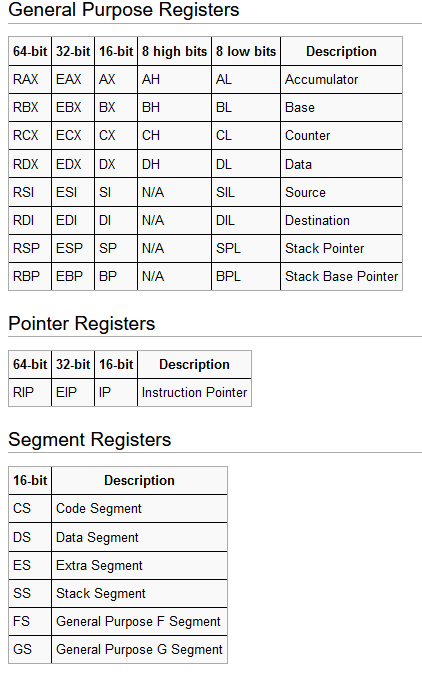
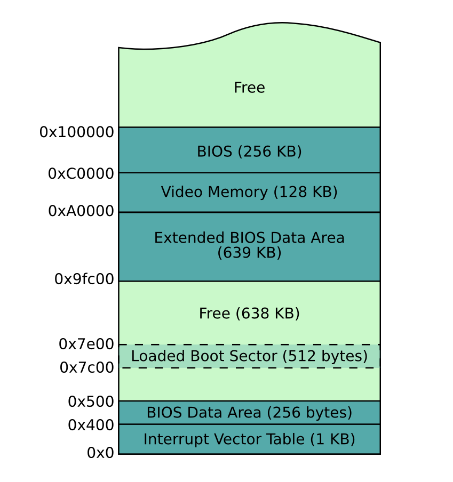

# Davidos

This repository aims at showcasing how a computer works under the hood when you have no operating system to do all the heavy lifting for you. Our goal will be to create a minimal operating system with some basic I/O drivers that allows us to run different mini games like a custom pong implementation. It is by no means a complete explanation or tutorial on everything that goes on in detail. Rather, it focuses on a subset of concepts I found interesting and wanted to learn more about at the time of writing.  

Topics addressed will include different hardware components and how to interact with them, assembly basics and some information about the boot process and BIOS. We will look at how to display text by writing to the screen, take user input from a keyboard and how to read from a disk. Along the way we will learn about important concecpts like addressing, the memory map, device I/O and interrupts. 

## Interacting with the system

At the core of any computer system lies the central processing uint (CPU). Its job is to execute instructions of our programs. This includes handling arithmetic, logic and control operations and also I/O operations to interact with all the other devices of our system. To interact with any part of the system, the CPU needs to know where this part of the system is located. A location might be a certain place on the motherboard, where a device we would like to interact with is connected to. I.e. this might be a keyboard. 

A location is defined by an address. An address is a binary number of a certain size. The size of the number/address might depend on the type and mode of the CPU we are currently using or the device you want to interact with. For example the maximum number of an address could be limited by the actual number of physical address lines/pins of the CPU. We will go into more detail about this later on.

A device might be assigned many addresses in order to interact with or refer to different parts of that device. A good example of this is the memory device. Each byte of memory that can be accessed is referenced by an individual, specific address/number.  

## The boot process

The very first program our computer runs after a reboot is the basic input/output software (BIOS). At this point in time we do not have an operating system available for us at all. The BIOS is a collection of software routines stored on a read only memory (ROM) chip. The CPU expects the BIOS to be located at a specific address. This is where the CPU will attempt to start reading its first instrcutions. The job of the BIOS is to:
- detect RAM chips and initialize main memory by setting up a stack and the interrupt vector table (IVT).
- detect and configure other hardware like the bus, pic, disk, usb or display devices amongst others.
- indentify bootable devices and transfer control to the bootsector by loading it to the specific address 0x7c00. This is where our own code/program will start.

We will first concern ourselves with the bootsector. It is a program, that is stored in the first 512 bytes of our bootable device i.e. disk drive. To identify a bootsector the BIOS checks, that the value of the last two bytes 511 and 512 matches the magic sequence 0xaa55. To see this in action, we can start by writing our first bootsector. Take a look at "./tutorials/01-basics.asm" for an example bootsector that prints the letter a to the screen using a routine that was setup for us by the BIOS. The code will be commented in detail to explain some basics of x86 nasm assembly (just as much as we need for our purposes) and common commands we will use a lot throughout this project. In case you have never heard about registers before, pls read the CPU section below first.

## Hardware

When it comes to hardware, we will concern ourselves with:
- the x86 CPU
- the 8259 programmable interrupt controller (PIC)
- a cylinder head sector addressable (CHS) disk drive
- a video graphics array (VGA) compatible screen
- random access memory (RAM).

### CPU

As is the case for any hardware, a lot of work goes into improving it over time. In order to run, a lot of software requires specific features of specifc CPU versions. If a new version of a CPU would change those features, this kind of software could no longer be run on the new CPU. To prevent this, CPU manufactures go to great length to keep new CPU versions compatible with older ones. In case of the x86, the solution was to emulate the oldest version in the CPU family, the Intel 8086. It only supported 16 bit instructions compared to its 32 and 64 bit successors.

Therefore, when we first start up our computer, the x86 CPU will run in 16 bit real mode. This means instructions for our CPU can only work with 16 bits at once. For example, the CPU has an instruction, that allows us to add two 16 bit numbers together during a single CPU cylce. Adding larger numbers would require more cycles.

We will start exploring 16 bit real mode before switching to a more powerful 32 bit protected mode later on.

#### CPU registers

Depending on the CPU mode, different CPU registers are used for executing instructions. Registers are used as a temporary data storage when we are running a particular routine. For this purpose the x86 has many different registers. An overview of which can be seen below.

Throughout this project, we will learn how to use these registers extensively. Note, that not all instructions can be used with all registers. Each register has its own purpose, constraining which instructions it can be used with. We will not go into detail about this. It is just important to keep in mind when debugging our code later on. The descriptions of the above register overview can be used as a guidline however, for which register might be used for different types of operations. Enough of that. Let's get back to writing programs in real mode. 

#### Real mode addressing

Since we are bound to 16 bit instructions, we only have 16 bits that can be used for addressing. We can only address up to 2^16 bytes or 64kB of RAM. Even for a lot of old systems, that is not enough space to work with. In order to make more memory accessible, Intel thought of a workaround. The concept they came up with is called segmentation. It is a certain way of combining the values of two registers, one of wich is a so called segment register, such that we can generate a larger address to work with. Note, that the maximum number of bits we can use for addressing in this way is 20. We can not simply use two 16 bit registers for addressing. The 8086 CPU only had a maximum of 20 physical address lines/pins we could use. As a result we can address up to a maximum of 1 MB of RAM. For an example and more details of addressing using segmentation in real mode, take a look at "./tutorials/02-rm-addressing.asm".

#### CPU and the stack

Although the CPU has many registers, it is still quite limited in the amount of space it provides for storing variables. We often need more storage space than will fit into these registers. We could make use of main memory to accomplish this. However this would require us to provide specific addresses when reading and writing. This is quite inconvenient. We do not really care where temporary data is stored, but we want to retrieve and store it easily.

The solution to this problem is the stack. It is a space in memory defined by two special CPU registers, BP and SP. They are used to maintain the address of the stack base/bottom and the stack top. We can use instructions PUSH and POP to store a value to and retrieve a value from the top of the stack. The size of the value depends on the CPU mode. I.e. in 16 bit real mode the stack only works on 16 bit boundaries.

As we push data onto the stack, the stack expands/grows. We usually set up the stack far away from important regions of memory, as can be seen below. We do not want the stack to overwrite code set up by BIOS or our own code for example.

Important to note is, that the stack expands/grows downwards from the base pointer. Issuing a PUSH places the value below and not above the address of BP. SP is decremented accordingly. For an example of how to set up the stack, see "./tutorials/03-stack.asm".