# Davidos

This project attempts to design and implement an amateur operating system. I started this project purely out of curiosity. As such, a lot of design decisions and discussed topics will be based on what i find interesting and want to learn more about. Since i have never done this before, i will focus on simplicity above all else. Nevertheless, mistakes will be made. Even though i will try to document my journey to the best of my ability, all explanations should be taken with a grain of salt. With that out of the way, let's get started.


## 1 The boot process

As soon as we press the the magical power button on our computer, it starts working. The motherboard sends a signal to the power supply device. The power supply device starts providing electricity. Once the voltages for all powered devices reach their specified level, the power supply sends a power-good signal to the motherboard. The motherboard then starts the CPU. The CPU resets all leftover data in its registers and sets predefined values for each of them. This includes setting up the instruction pointer to start executing its first instruction at address 0xfffffff0. This point is called the reset vector. It is a memory location in read only memory (ROM) that contains a jump instruction to another memory location in ROM, where the basic input output system (BIOS) code starts.

The BIOS first detects and initializes hardware. As a result we can start using random access memory (RAM) and other devices like hard disk drives and display devices. After hardware initialization the BIOS needs to find a bootable device. A part of the BIOS configuration is the boot order. It determins which devices the BIOS attempts to boot from. To boot from a device, the BIOS tries to find a boot sector on that device. A sector is 512 bytes in size. A boot sector is stored in the first 512 bytes or the first sector of a storage device. The last two bytes of the boot sector must be the magic number 0x55aa. This number designates to the BIOS that the device is bootable.

After finding the bootable device, the BIOS loads the boot sector from the storage device into RAM to the specific address 0x7c00. It then jumps to 0x7c00 and thus leaving the BIOS and entering the boot sector. The boot sector usually contains code that loads the bootloader into memory and executes it. The bootloader in turn will then load the kernel into memory and start the operating system. From this point on, the operating system is in control of our computer.

We will start out by writing a simple boot sector program, before we get into writing a bootloader. All it will do is print a letter to the screen. One thing to note is, that at this stage we are in a low level, hardware specific environment. In our case we are runnning on a qemu emulated x86_64 system. This means the instuction set our CPU understands is specific to Intel x86. We also have to deal with other x86 unique features like the CPU mode. After the BIOS jumps to 0x7c00 for example, we are in so called [real mode](#4-addressing-in-real-mode). Even though we could try to find a specifc compiler that would allow us to use C in x86 real mode, boot sectors and bootloaders are commonly written in the respective architectures assembly language. We are going to use NASM assembly.

The code to our first boot sector can be found in [tutorial 1](./src/tutorials/01-basics.asm). To make the most of it, the code is commented extensively. For a more general explanation of NASM assembly code structure, it might be worth to have a look at [chapter 2](#2-instruction-operands-optional) first.

One thing to point out about the above example, is the use of software interrupts. The BIOS uses software interrupts to set up many convenient helper functions for us. This enables us to use them, without having to know, where exectly in memory they are located. They allow us to print to the screen or read data from disk into memory amongst others. These helper functions hide a lot of complexity from us. This is great, since we are just starting out on our low level programming journey. Once we have gathered enought knowledge, we will start replacing them with our own implementations one by one. 

Inside the tutorials directory we can assemble our bootsector using the command:
```
nasm 01-basics.asm -f bin -o 01-basics.bin
```
We run it using:
```
qemu-system-x86_64 01-basics.bin
```
To view the actual opcodes and arguments generated in hexadecimal form, we can use:
```
od -t x1 -A n 01-basics.bin
```
Alternatively we can use the provided Makefile configuration to build and run either our operating system or the tutorials.


## 2 Instruction Operands (optional)

Our CPU only understands binary instructions. They consist of so called opcodes and their optional arguments. These binary instructions are really hard to read for humans. Therefore tools called interpreters exist, that allow us to write instructions symbolically in a more readably form called assembly language. Different types of assembly language exist. We are going to use NASM assembly.

Instructions using NASM assembly have the following format:
```
label: mnemonic argument1, argument2, argument3
```
where:
- A label is an identifier which is followed by a colon. Labels are optional. A label translates to the offset of the following instruction. The offset is based on the location counter. If not specified otherwise the location counter is set to zero at the beginning of assembly. Each assembled byte increases the location counter by one. I.e. if previously assembled instructions translate to 5 bytes of opcodes and arguments, the following label would translate to an offset of 6.
- A mnemonic is a reserved name for a class of instruction opcodes which have the same function.
- The operands argument1, argument2 and argument3 are optional. When present they take the form of either literals or identifiers for data items. Literals are also called immediate values. Operand identifiers are either reserved names of cpu registers or are assumed to be assigned to data items declared in another part of the program. I.e. a label referencing some data. When two operands are present, the right operand is the source and the left operand is the destination.

For example:
```
load_result_to_reg: mov eax, result
```
In this example load_result_to_reg is a label and mov is the mnemonic identifier of an opcode. The destination operand ist eax and the source operand is result. The destination operand is the eax register of the cpu. The source operand value in this case is the address represented by the result label.

Although we are going to use a lot of different instructions throughout this project, we are not going to come close to using all of them. We are simply going to us as many as we need to fullfill our purposes. Explanations on the instructions used will be provided in the code comments of either the tutorials or the actual os.


## 3 CPU to device communication - Hardware view (optional)

In [chapter 1](#1-the-boot-process) we mentioned, that the CPU uses addresses to target devices it wants to interact with. It is worthwhile to understand how this works physically. It might make it easier to understand concepts like address spaces, [port and memory mapped I/O](#41-port-mapped-and-memory-mapped-io) later on.

The CPU usually does not interact with devices directly. It instead communicates with so called controllers. Controllers in turn manage their respective devices. To access main memory or RAM for example, the CPU interacts with the memory controller. For ROM there exists a ROM controller and for video display devices a display controller respectively. The CPU is connected to these controllers via a bus.

For simplicity reasons, we can think of a bus as multiple parallel electrical wires with multiple hardware connectors. For each wire, there is a respective pin on the connector. If a controller sends a signal to the bus, all other connected controllers receive that signal. Usually a signal is intended for a specifc controller. We therefore need a mechanism, that allows us to select the controller that should receive the signal. One way to achieve this is by using subsets of the buses wires for different purposes. Let's imagine we have a bus with 16 wires or lines. We use the first 8 wires for the purpose of selecting or addressing the target controller we want to communicate with. We call these wires the address bus. We use the second 8 wires to send the instruction or data intended for the selected controller. We call these wires the data bus. Next, we assign each controller a specific address. Now imagine the below setup.

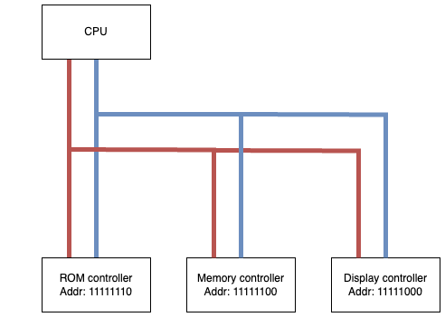

To comunicate with the ROM controller the CPU first sends the signal 11111110 to the address bus. The ROM controller now knows, that it should handle the following instructions or data sent on the data bus. The memory and display controller in turn know, that they can ignore it.

Even though oversimplified, the previous example should give us the basic idea behind bus communication. There are a few things to point out though.

In the example we simply assigned addresses to the controllers. In reality, depending on the type of bus used, there are different ways this is done. For legacy buses and devices such as the ISA bus addresses where standardized. Controllers conforming to the ISA standard had their designated addresses preconfigured inside the controller itself. More modern buses like PCI allow for dynamic software configuration via bus enumeration. Thankfully, we usually do not have to configure a PCI bus ourselves, since the BIOS does so for us.

Contrary to our example, controllers usually are assinged multiple addresses. For example, depending on the amount of RAM available in our computer, the memory controller may be assigned all available addresses, excluding those assigned to other devices. Each memory controller address may refer to a different byte of RAM in that case. A controller that is assigned multiple addresses may also use them for different purposes. One address might be used to reference controll registers of the device, whereas another might be used for data registers.

Another thing to point out is, that in modern CPUs and buses, the address and data bus can be multiplexed. This means the same wires are used for sending address and data signals. Address, instructions and data are sent in sequence. A so called bus protocol defines how to interpret a specific sequence of signals. Devices connected to a bus must know and adhere to the respective bus protocol.

Last but not least, some system architectures including x86 use a concept called address spaces. A separate wire called I/O line on a bus is used to switch between address spaces. An address space is the number of unique addresses that can be generated using all address bus wires. Without the additional I/O line this means we have a single address space and all devices connected to the bus will be assigned addresses in this space. The I/O line enables us to have two address spaces. They both contain the same addresses. If the I/O line is enabled, we usually refer to the resulting address space as I/O space. If the I/O line is disabled, we refer to the address space as memory space, since this is usually where our main memory or RAM addresses are assigned to the memory controller. In a setup with two address spaces, the same address may refer to different devices or registers depending on which address space the device or register was mapped / assigned to. This will be important later on, when we talk about [memory mapped and port mapped I/O](#41-port-mapped-and-memory-mapped-io).


### 4 Addressing in real mode

Modern 64 bit CPUs are called such because they can handle 64 bit sized instructions. In theory this means, that they are able to address up to 2^64 addresses. With each address referring to a single byte, the resulting address space would be 2^64 bytes or 16 exabyte in size. Due to different technical reasons, the acutal available address space is smaller in reality.

Historically, the earliest versions of x86 CPUs did not come close to handling 64 bit instructions. The first generations of x86 CPUs were limited to 16 bit instructions. The way these earliest x86 16 bit CPUs worked, was later called real mode. Even today all x86 CPUs still support real mode for backward compatibility. Infact all x86 CPUs initially start running in this 16 bit real mode. It is up to the bootloader to switch to a more modern CPU mode i.e. long mode, which uses 64 bit instructions. For the purpose of our miniature operating system, we will keep using real mode for now though. 

In theory, using 16 bit would limit us to an address space of 64 KB. Intel uses a concept called segmentation to extend the available address space size. Instead of only using a single 16 bit general purpose register to calculate an address, an additional 16 bit segment register is used. The combination of both registers allows us to address up to 2^20 bytes or 1 MB of memory. The reason the avaiblable address space ist limited to 2^20 addresses instead of 2^32 is due to hardware design. 8086 CPUs only had 20 physical address pins, limiting the address bus to 20 lines.

The following notation is used to specify a byte address using segmentation:
```
Segment-register:Byte-address-offset
```
For example, 0x06EF:0x1234 translates to the address 0x08124.
The address is calculated by multiplying the segment register value by 16. This is equal to left shifting it by 4. Afterward the byte address offset is added.
```
0x06EF * 0x10 + 0x1234 = 0x6EF0 + 0x1234 = 0x08124
```

x86 CPUs use multiple segment registers for different purposes.

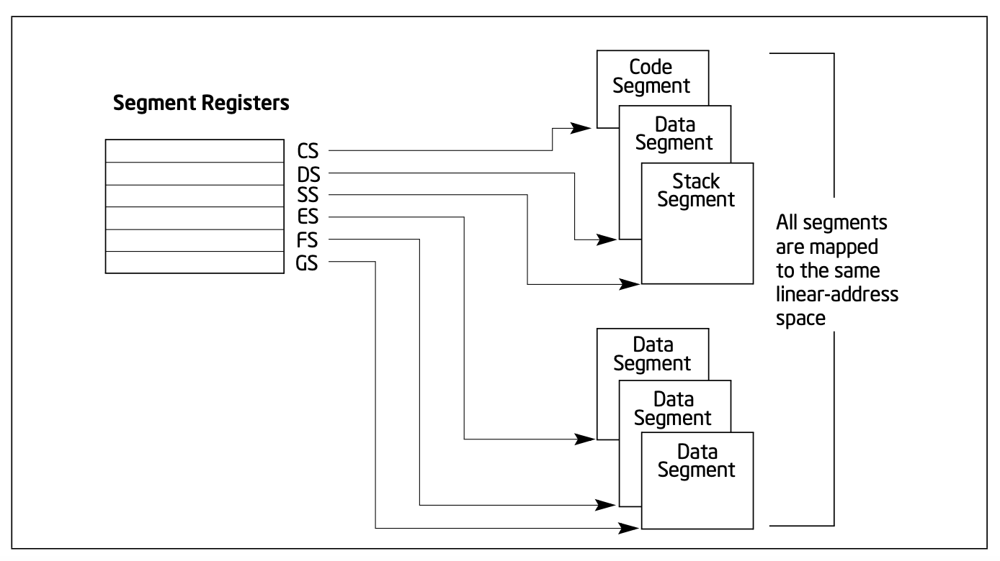

Based on the type of instruction, a different segment register might be used to store or retrieve data. For example the address of the next code instruction in memory is calculated using the code segment register CS and the instruction byte offset, while label addresses are based on the data segment register DS in combination with the label offset. Instructions manipulating the stack use the stack segment register SS. For an example take a look at "./tutorials/02-rm-addressing.asm".

If we attempt to access data in memory using and illegal register, we will run into an "invalid effective address" error. To prevent this from happening beforehand, here is a list of registers that are good to use.

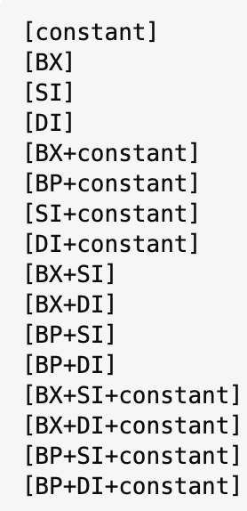


## 5 Hardware

There is a lot of different hardware that makes up our computers. Different graphics cards, network cards, hard disk drives, controllers, keyboards, mouses and so on. For each of these devices, a myriad of types and versions from different manufacturers exist. If all of these devices had individual access and configuration mechanisms, building an operating system that could manage all or even most of them would be impossible. Thankfully, over time hardware manufacturers developed access and configuration standards. This way we can build an operating system that can cover a multitude of compatible devices. This does not mean, that an operating system can simply run on all hardware systems. Different hardware systems may still conform to a different set of standards. It is possible though, to support many of them.

In order to choose the correct access mechanism for our hardware, our operating system must be aware of the hardware it is running on. Similar to the BIOS an operating system implements a hardware detection mechanism for this purpose. This usually involves querying the available buses for connected devices. We would start with the main bus directly connected to our cpu, continuing for each bus connected to this one and so on. This can become quite tedious.

Older legacy buses like the ISA did not allow us to freely choose to which port we would like to connect our devices. The industry standard architecture (ISA) expected us to connect specifc types of devices to specifc connectors on the bus. Based on the type of device and connector, static addresses were assigned to the devices. These addresses had to be preassigned to connected devices via configuration. They were called standardized I/O ports. Section 4.1 covers I/O ports in more detail.

Our qemu emulated system comes with an ISA bridge and connected devices. For simplicity we are going to use standardized I/O ports instead of a discovery mechanism to interface with our devices.

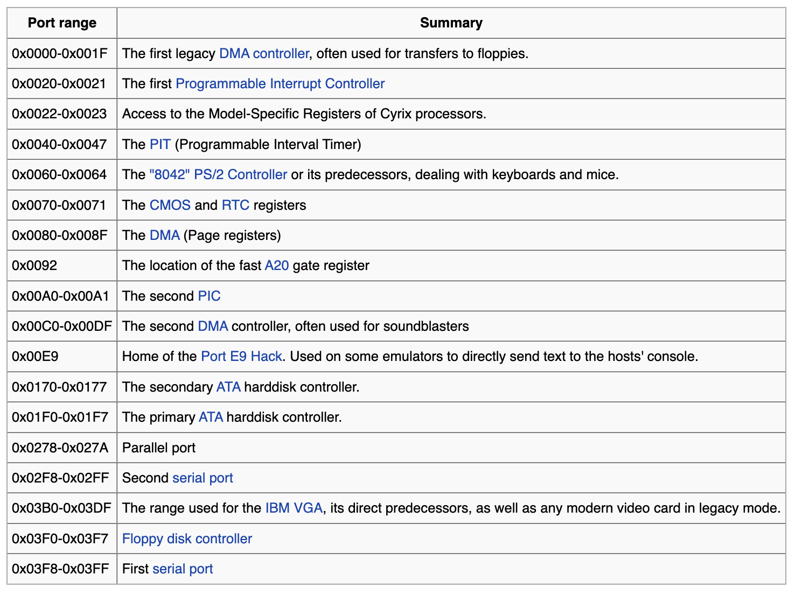

Apart of the x86-64 CPU and RAM, qemu emulates the following hardware for us:
- i440FX host PCI bridge
- PIIX3 (Chipset) PCI to ISA bridge with:
    - IDE/ATA controller
    - two 8237 DMA controllers
    - 8254 PIT
    - two 8259 PICs
    - PCI to ISA bus bridge
    - USB 1.0 controller
    - support for external I/O APIC
- Cirrus CLGD 5446 PCI VGA card or dummy VGA card with Bochs VESA extensions (hardware level, including all non standard modes).
- PS/2 mouse and keyboard
- 2 PCI IDE interfaces with hard disk and CD-ROM support
- Floppy disk
- PCI and ISA network adapters
- Serial ports
- IPMI BMC, either and internal or external one
- Creative SoundBlaster 16 sound card
- ENSONIQ AudioPCI ES1370 sound card
- Intel 82801AA AC97 Audio compatible sound card
- Intel HD Audio Controller and HDA codec
- Adlib (OPL2) - Yamaha YM3812 compatible chip
- Gravis Ultrasound GF1 sound card
- CS4231A compatible sound card
- PC speaker
- PCI UHCI, OHCI, EHCI or XHCI USB controller and a virtual USB-1.1 hub

We will focus on the Cirrus CLGD 5446 PCI VGA card for displaying things on the screen, the 8259 PIC for handling interrupts i.e. from our keyboard, the keyboard itself for user input and the ATA controller to read from the disk.


### 5.1 Port mapped and memory mapped I/O

In chapter 3 we mentioned, that addresses may refer to registers of I/O devices. We also briefly covered the importance of the control bus for setting the read/write status.

In x86 processors starting with the 8086, the control bus has another important function. Apart from the read/write status, the CPU can set an I/O request status. Based on the status, devices connected to the bus were signalled to handle the incoming address on the address bus differently. This means the same address on the address bus can refer to two different things. As a result, we have 2 separate address spaces sharing the same addresses. 

If the I/O request status is not set, we call the address space referred to "memory space". We call addresses within this space "memory addresses".
The main purpose of using the memory address space is to access main memory aka RAM. Another purpose is to perform input/output between the CPU and peripheral devices using memory mapped I/O. Some addresses of the memory address space are reserved for specific registers of some peripheral devices. If the CPU attempts to write some data to such an address, that data is written directly to the mapped devices register and not to RAM. As a result not all of RAM is available to us. A concret example of this would be the VGA text buffer. It is mapped to addresses 0xb8000 to 0xbffff. This amounts to 32 KB we can not address inside RAM, thus reducing the actual available RAM by 32 KB. If all devices used memory mapped I/O, a lot of RAM would not be available to us. Today this would not realy pose a problem. Earlier x86 Systems are a different matter. As we learned in section 3.1 we only have 1 MB of memory available in real mode. To tackle this issue Intel set up a second address space.

If the I/O requrest status is set, we call the address space referred to "I/O space". We call addresses within this space "I/O ports". Almost all peripheral devices have some of their registers mapped to the I/O address space. In our code we can signal the CPU to use I/O ports by using the special instruction IN and OUT.


### 5.2 CPU

As is the case for any hardware, a lot of work goes into improving it over time. In order to run, a lot of software requires specific features of specifc CPU versions. If a new version of a CPU would change those features, this kind of software could no longer be run on the new CPU. CPU manufactures go to great lengths, to keep new CPU versions compatible with older ones. This is also the case for x86 CPUs. Every x86 CPU can emulate the oldest version in the CPU family, the Intel 8086. As we already mentioned in section 3.1, for this reason all CPUs start running in 16 bit real mode. This means instructions for our CPU can only work with 16 bits at once. For example, the CPU has an instruction, that allows us to add two 16 bit numbers together during a single CPU cylce. Adding larger numbers would require more cycles.


#### 5.2.1 CPU registers

Depending on the CPU mode, different CPU registers are used for executing instructions. Registers are used as a temporary data storage when we are running a particular routine. For this purpose the x86 has many different registers. An overview of which can be seen below.

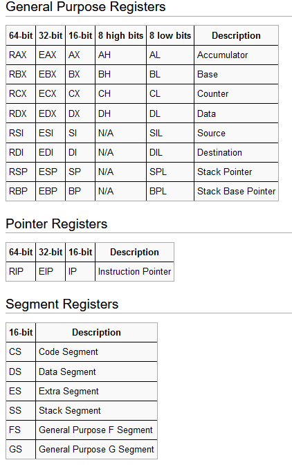

Throughout this project, we will learn how to use these registers extensively. Note, that not all instructions can be used with all registers. Each register has its own purpose, constraining which instructions it can be used with. We will not go into detail about this. It is just important to keep in mind when debugging our code later on. The descriptions of the above register overview can be used as a guidline. The Intel software developer manual contains detailed documentation for all current x86 CPUs. It can be found in the "docs" directory.


#### 5.2.2 CPU and the stack

Although the CPU has many registers, it is still quite limited in the amount of space it provides for storing variables. We often need more storage space than will fit into these registers. We could make use of main memory to accomplish this. However this would require us to provide specific addresses when reading and writing. This is quite inconvenient. We do not really care where temporary data is stored, but we want to retrieve and store it easily.

The solution to this problem is the stack. It is a space in memory defined by two special CPU registers, BP and SP. They are used to maintain the address of the stack base/bottom and the stack top. We can use instructions PUSH and POP to store a value to and retrieve a value from the top of the stack. The size of the value depends on the CPU mode. I.e. in 16 bit real mode the stack only works on 16 bit boundaries.

As we push data onto the stack, the stack expands/grows. We usually set up the stack far away from important regions of memory. We do not want the stack to overwrite code set up by BIOS or our own code for example.

Important to note is, that the stack expands/grows downwards from the base pointer. Issuing a PUSH places the value below and not above the address of BP. SP is decremented accordingly. For an example of how to set up the stack, see "./tutorials/03-stack.asm".


### 5.3 Cirrus CLGD 5446 PCI VGA card

Video graphics array (VGA) initially was a video display controller introduced in IBM computers.
It was characterized by using a new VGA connector, RGBHV signalling and supporting specific resolutions as well as a collection of graphis and text video modes. VGA turned into a standard over time. To date a lot of modern GPUs still implement common VGA modes and interfaces in addition to their proprietary interfaces. Although since 2011 manufacturers starting dropping VGA for GOP or UEFI.Qemu still emulates it though, so we are going to make use of it.

Initially the VGA card is set to a 80 x 25, 16 color text mode. We will not go into changing VGA modes as part of this project. It would require us to access a multitude of registers and the process is documented poorly. Simply put, it is just not worth the effort. The initial text mode will suffice for our purposes. Below is a quick overview of the standard vga display modes nonetheless.

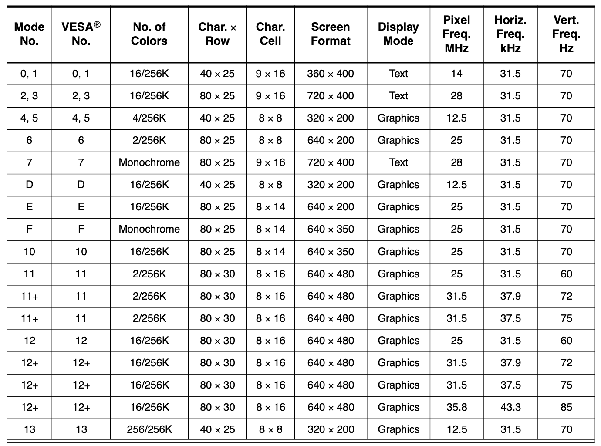

VGA has special video buffer registers that are directly mapped to memory. The frame buffer contains a bitmap that drives the video display. It is a memory buffer containing data representing all pixels in a complete video frame.

The text buffer abstracts away some of the complexity. We do not have to set every single pixel individually. It allows us to only store information about a character and its attributes like foreground and background color in main memory. The VGA hardware then translates this information into the respective pixel data. In text mode the screen is split into a grid of characters, usually 80x25 or 40x25. For simplicity, we can think of the grid in terms of lines and columns.

The text buffer uses 2 bytes to represent each character in the grid. They contain the following information.

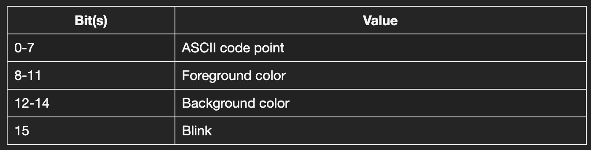

We can choose between 16 colors.


The first two bytes of the buffer represent the top and left most character in the grid, aka line 1, column 1. The second two bytes represent the character in line 1, olumn 2. The last two bytes of the buffer represent the character in line 25, column 80. 

In "./tutorials/04-display-text-and-numbers-vga.asm" we will use the text buffer to write to the screen.

VGA devices have over 300 internal registers. The technical CLGD documentation contains detailed information about all of them. It can be found inside the "docs" directory.

It is not feasable to map all registers to the I/O or memory address space. To cope many I/O space registers are indexed. A block of registers comes with two additional registers. The first is an index register whose only purpose is to to store the index of the specific register, we would like to access inside the block. The second is a data register containing the value of the register referenced by the index register.

Writing to a register turns into a two step process. First we write the index of the register we would like to access to the I/O port of the index register. Then we write the value we would like to set this register to, to the I/O port of the data register.

The text mode cursor can be manipulated this way. In "./tutorials/05-cursor-vga.asm" we will move the cursor to different places on the screen.


### 5.4 ATA Controller

We successfully managed to create our first driver. Even though it is a very simple driver, we still wrote quite a bit of assembly code. We are going to write a lot more. Before we can do so however, we have to address a problem we are going to run into soon. Our programs will outgrow the 512 byte boundary of the bootsector. So far the BIOS conveniently loaded this sector into memory for us. It is up to us, to load additional sectors of code and data from the hard disk. We want to continue running lots and lots more code. We will continue by writing an ATA disk driver.

The AT (Bus) Attachment aka ATA interface standard defines an integrated bus interface between disk drives and host processors. It consists of a compatible register set and a 40-pin connector and its associated signals. Its primary feature is a direct connection/attachment to the ISA bus aka the AT bus, hence the name ATA. ATA supports up to two drives being connected in a daisy chain. Drives are selected by a DRV bit, specifying drive 0 or drive 1. A drive can operate in either of two modes, cylinder head sector (CHS) or logical block addressing (LBA) mode.

We are going to use LBA. LBA splits disk space into 0 to n linear blocks of data. A block or sector is 512 bytes in size. If our drive contains a bootsector, it is located at logical block address 0. The next sector would be LBA 1 and so on.

Reading sectors from an ATA drive can be done in several ways. We are going to use programmed input/output (PIO). PIO is a means of data transfer via the host processor. The drive does not write data directly to memory (DMA), but "routes" it through the CPU. We are going to use the PIO data in command "read sector(s)" specifically. To execute this command, we go through the following process.

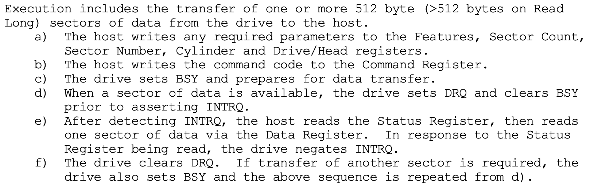

The base I/O port for the command block registers according to the ISA is 0x1f0. The base address maps directly to the data register. The command register offsets are as follows.

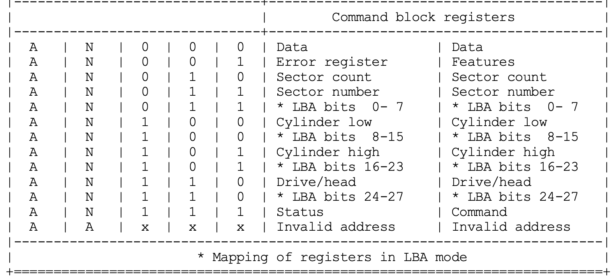

The error register would be I/O port 0x1f1. The sector count register would be I/O port 0x1f2 and so on.

To signal to the drive, that we would like to use LBA for data transfer, we have to set the data/head register a certain way.

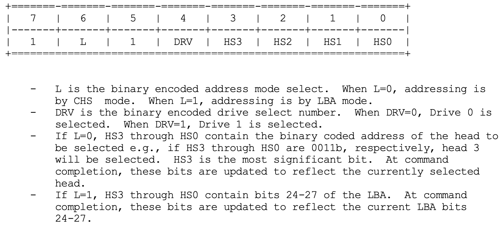

Once we have set up the drive/head register, the cylinder high, cylinder low and sector number register will only be used for storing the remaining LBA bits. The number of sectors we want to read will be stored inside the sector count register. We are now ready to send the read command to the drive and follow the remaining steps of the data in command. An example can be found in "./tutorials/06-read-disk.asm".


### 5.5 8259A PIC

So far, all communication between the CPU and the VGA card or ATA controller was initialzied by the CPU. This makes a lot of sense for a output devices without any user interaction. We are never going to use the display as an input device. But what if we wanted to change something in our system or program while it is already running. We might want to input some commands using the keyboard for example. In that case we would need a mechanism for detecting that a key was pressed and then act on it. Early computer systems used a mechanism called polling to achieve this. The CPU would periodically test every single input device in sequence and effectively ask each one, if it needs servicing. With every additional device we need to test, this polling cycle becomes more inefficient.


#### 5.5.1 Interrupts

A more desirable method would be one, where the input device would actively notify the CPU, that it needs servicing. The CPU could continue running the main program. It would only stop to do so, once a servicing request from a peripheral device is received. This method is called interrupt.

The signal sent to the CPU by the input device is called an interrupt request (IRQ). It tells the CPU to complete whatever instruction it is currently executing and then switch to a new routine, that will service the requesting device. The new routine is called an interrupt service routine (ISR).


#### 5.5.2 Programmable interupt controller (PIC)

The PIC functions as an overall manager in an interrupt driven system. Input devices can be connected to the PICs interupt lines. The PIC accepts IRQs of the connected devices. It then determines which of the incoming requests is of the highest importance/priority and issues an interrupt to the CPU.

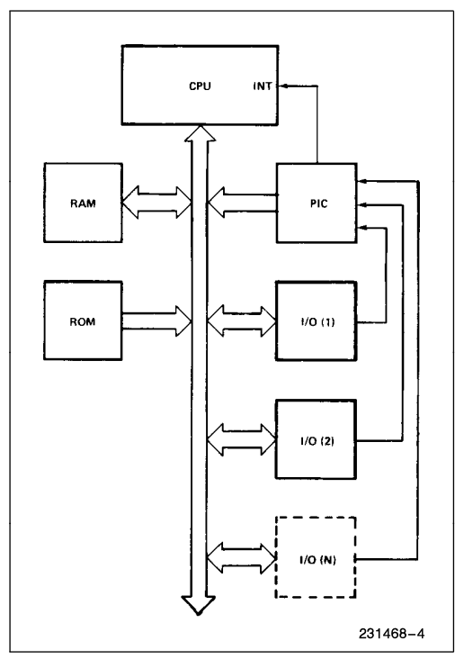


#### 5.5.3 Interrupt vector table (IVT)

After issuing an interrupt to the CPU, the PIC must somehow input information into the CPU that can point the program counter to the ISR associated with the requesting device. This pointer is an address in a vectoring table. In real mode this table is called the interrupt vector table (IVT). An entry in this table is called an interrupt vector. The pointer passed to the CPU by the PIC is the starting address of an interrupt vector. While the actual interrupt signal is sent to the CPU via the interrupt line, the interrupt vector address is sent via the normal data bus. The specifc interrupt vector address the PIC sends to the CPU for each IRQ can be configured on the PIC side.

In a x86 system in real mode, the IVT usually looks something like this.

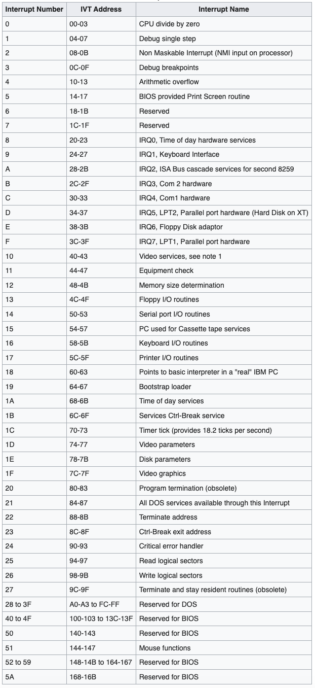

The names of 8 interrupt vectors starts with IRQ0 to IRQ7. These are the vectors used to by the PIC. Since they are triggered by the PIC as a response to actual hardware, they are called hardware interrupts.

As we can see apart from the hardware interrupts, there are many other vectors inside the IVT. Some point to routines that should be executed once the CPU runs into a certain error. The first vectors in the IVT are usually reserved for such routines. Others are routines that should be run for so called software interrupts. These are interrupts, that are triggered explicitly from within our programs using the INT instruction. In tutorial 1 we used software interrupt 0x10 to display text on the screen. We will not go into detail about software interrupts for this project though.

#### 5.5.4 8259A specifics

All details about the 8259A can be found in the respective documentation inside the "docs" directory. The 8259A PIC has 8 interrupt lines, IR0 till IR7. It can be extended by connecting up to eight slave 8259As to one master 8259A. This results in up to 64 interrupt levels or requests. In our qemu system we have 2 connected/cascaded 8259As for a total of 15 different interrupts. One interrupt line on the first PIC is used for the connection to the second one. The master PIC receives interrupts from the slave PIC on this line. Both PICs are connected to the ISA bus.

The master and slave PICs can be addressed using two I/O ports each. They can be used by the CPU to send so called initialization command words (ICW)s and operation command words (OCWs) to the PICs. The master PIC uses I/O ports 0x20 and 0x21. The slave PIC uses 0xa0 and 0xa1.


#### 5.5.5 Programming the 8259A

To configure the 8259A for use in an x86 system, we have to pass it 4 initialization command words (ICWs) in sequence. While ICW1 is sent to I/O port 0x20/0xa0, ICW2 to ICW4 are sent to I/O port 0x21/0xa1. ICW3 and ICW4 may be optional depending on the selected configuration.

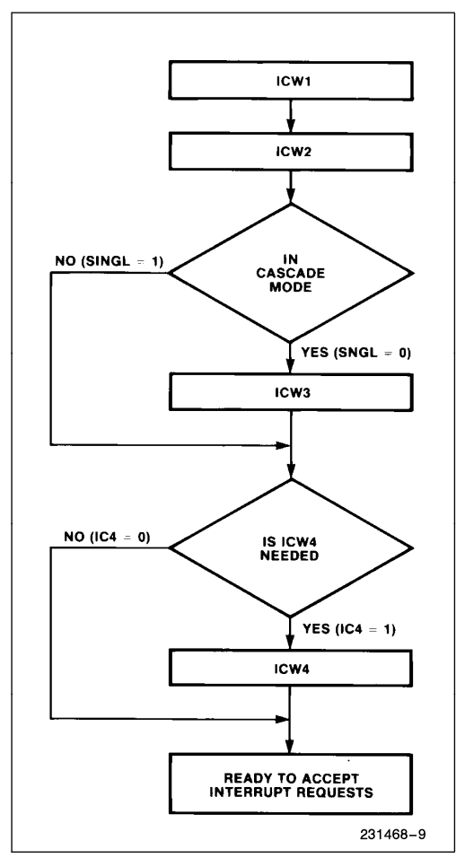

ICW1 starts the initialization sequence. It holds basic information about the PIC setup.

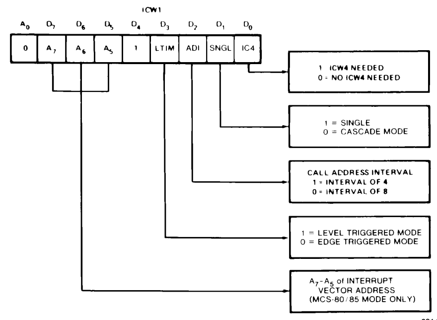

Note, that in an x86 system, the call address interval configuration is not required and thus ignored.

ICW2 configures the interrupt vector addresses generated for all IRQs of the PIC.

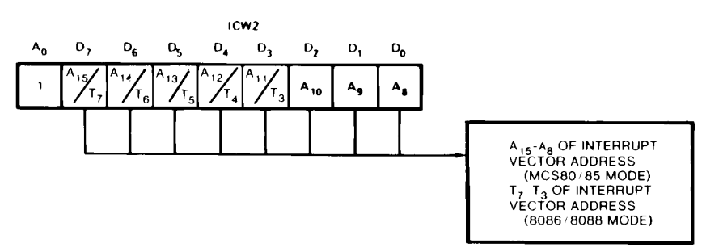

In an x86 system the PIC does not generate the actual starting address of the interrupt vector in memory, but rather an interrupt number. The CPU uses the interrupt number to calculate the actual vector address. A15 till A11 are inserted in the five most significant bits of the vectoring byte. The three least significant bits are set to the current interrupt level by the 8259A. It is common for A15 to A11 to be set to the value 0x8. We can think of this value as an offset for the interrupt numbers. Since the 8259A automatically adds the currently prioritized interrupt line numer/level to the lowest three bits, offset and interrupt level are basically added together. With an offset of 8, interrupt 0 becomes interrupt 8. Interrupt 1 becomes interrupt 9 and so on.

ICW3 for the master PIC is used to select which interrupt line on the master PIC should connect to the slave PIC.

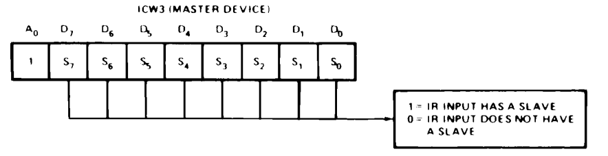

ICW3 for the slave contains the interrupt line number of the master, the slave is connected to aka the cascade identity. I.e if the slave is connected to the masters line 2, the ICW3 for the slave PIC would be 0x2.

ICW4 sets different PIC modes, i.e. 8086 mode.

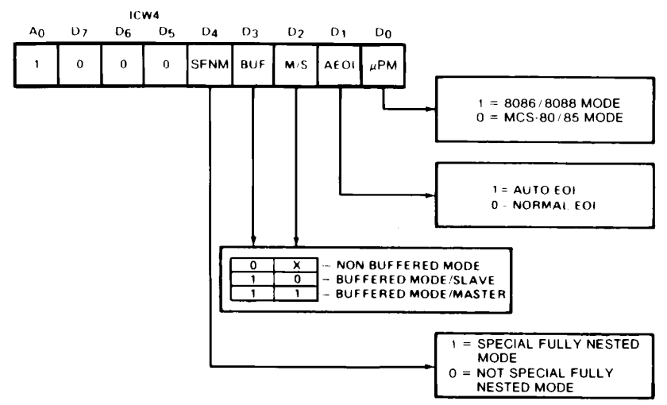

Code for a full example configuration of the 8259A PIC for use with a keyboard ISR can be found in "./tutorials/05-capture-pressed-keys.asm".


### 5.6 Keyboard

In "./tutorials/05-capture-pressed-keys.asm" we configure the PIC to have a single active interrupt line for IRQ1. Usually they keyboard device is connected to IR1 on the master PIC, which is also the case for our qemu setup. Each time a key is pressed, the keyboard triggers IRQ1 on the PIC. The keyboard has registers holding the so called scan codes of the currently pressed keys. They are mapped to standardized I/O port 0x60. Once a keypress generates an interrupt, further keypresses will not generate another one until they keyboard receives an end of intterupt (EOI) signal via I/O port 0x61.

We can write an ISR to read the scan code of the currently pressed key, send an EOI and return the scan code to the main program. We then have to translate the scan code to an ASCII code. To do this we use a map. Based on the keyboard layout we want to use, assign different ASCII values for each scan code. We can see this in action in the second part of tutorial 5.


## 6 Memory management

At this point we have developed all the drivers we are going to use for our operating system. We will use a "./os/bootsector.asm" and "./os/kernel-drivers.asm" file to set them all up from now on. Like we did in all the tutorials so far, all the required code will be read from disk to hard coded memory locations. This is fine, since we are simply setting up base functionality of our operating system.

Once we get into running user programs however, assigning static memory locations to load them will not be optimal.
User programs can grow in size over time. Previously assigned memory spaces could not be big enough to contain them anymore. Running all user programs at the same time may not be possible due to limited memory space. We should be able to use the same memory space for different programs based on what we choose to run at that time. We will need some form of memory manager, that will allow us to dynamically assign memory space to requesting applications.

We are going to use a first fit, implicit list memory manager. Initially we will specify a memory area, that is big enough to hold up to 20 sectors of code and data. For learning purposes, this should be enough for all the programs we are ever going to run. This initial memory area will contain so called boudary tags at the bottom and top of the area. We call the bottom boundary the header and the top boundary the footer. We call the memory space inbetween the boundaries payload. This is the actual memory space, that will be provided to an application. The memory area made up of the header, footer and payload is called a chunk. The header and footer of a chunk contain the size of the payload as well as a status flag, that indicates whether the chunk is free or in use.

If an application requests memory space that is smaller than currently available memory of a free chunk, that chunk is split into two chunks. One is assigned to the application and marked used or allocated. The other is appended to the first chunk. It contains the remaining memory space and is marked free. This way chunks form an implicitly doubly linked list. It can be easily traversed using the payload sizes contained in the boundaries to navigate to the next or previous chunk.

Finding free space that can be allocated to a requesting application is done using first fit. We traverse the list starting at the bottom and allocate the first free chunk, that is big enought to match the request.

Once a program exits, we can free the programs allocated memory. If neighboring chunks are also free, they are joined or coalesced into a single bigger free chunk. If all chunks are freed, we have returned to our initial memory list state of a single chunk spanning the entire initial memory area. The code can be found in "./tutorials/07-memory-manager.asm".


## 7 File menu

We need some kind of menu, that lets us select different programs we want to run. One way of doing this, is to separate each program into a single file. We then have a menu with an overview of all the files present. To select a file we can use the arrow keys to traverse through the menu. We press enter to load the program file to memory and run it. We set up a basic file table in "./tutorials/08-file-menu.asm".


## 8 System calls

Currently our programs call provided driver routines via labels. This only works as long as we keep all of our code within a single "root" ASM file, since all labels must be available in our code during assembly. If we wanted to add separately assembled program binaries to our operating system, they would not be able to call driver routines that way. There are different ways around this problem. We could use shared libraries or solve it some other way. For the purpose of this project, we are going to use this chance to introduce a concept calles system calls.

System calls aka Syscalls are a programmatic way in which a computer program requests a service from the operating system. These services can range from accessing hard disks to creating new processes. Syscalls provide an interface between user programs and the operating system.

The architecture of modern computer systems usually involves a security model. For example, the "rings model" specifies multiple privilidge levels under which software might be executed. The operating system usually runs under the highest priviledge level, while user programs run under a lower one. Usually programs only have access to services with the same priviledge level. Syscalls allow user space programs to request access to higher level operating system services.

Syscalls are often initialized via interrupts. One reason for this is, that an interrupt automatically places into an elevated priviledges state. Control is passed to the kernel.

In older Linux systems interrupt 0x80 was used for handling all syscalls. Based on a syscall number passed in EAX and arguments passed in other registers, the INT 0x80 ISR switched between calling other routines. These other routines contained the actual syscall logic. In modern x86 systems a new SYSCALL instruction was implemented, so the old INT 0x80 mechanism became obsolete.

We can not use the SYSCALL instruction in real mode. We are going to set up an INT 0x80 syscall ISR to handle our vga driver routines. This way our programs can use them via this interrupt. The code can be found in "./lib/syscall.asm".