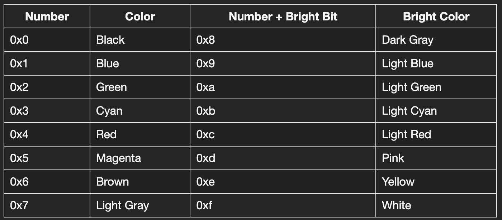

# Davidos

This repository aims at showcasing how a computer works under the hood when you have no operating system to do all the heavy lifting for you. Our goal will be to create a minimal operating system that allows us to run different custom mini games. It is by no means a complete explanation or tutorial on everything that goes on in detail. It rather focuses on a subset of important concepts worth learning about.

An operating system is system software that manages computer hardware and software resources. It provides common services for computer programs and acts as an interface for the user. Not only will it enable us to load our mini games from a disk, but also provide functions for displaying text on a screen, taking user input from a keyboard and running our games. Along the way we will learn about different hardware components and how to write drivers to interact with them. We will take a look at the boot process and the BIOS. We will find out how to address different parts of the system, how to use memory and handle device I/O.


## 1 Instruction Operands

In order to make our computer do anything, we need a way to tell it what we want it to do for us. This is done by supplying our computer with a list of instructions that tell it exactly what to do. In binary form, instructions consist of so called opcodes and their optional arguments. Since these binary instructions are really hard to read for a human, some really nice people built tools called interpreters for us, that allow us to write instructions symbolically in a more readably form using assembly language. Specifically we are going to use NASM assembly in our case.

Instructions using NASM assembly have the following format:
```
label: mnemonic argument1, argument2, argument3
```
where:
- A label is an identifier which is followed by a colon. Labels are optional. A label translates to the offset of the following instruction. The offset is based on the location counter. If not specified otherwise the location counter is set to zero at the beginning of assembly. Each assembled byte increases the location counter by one. I.e. if previously assembled instructions translate to 5 bytes of opcodes and arguments, the following label would translate to an offset of 6.
- A mnemonic is a reserved name for a class of instruction opcodes which have the same function.
- The operands argument1, argument2 and argument3 are optional. When present they take the form of either literals or identifiers for data items. Literals are also called immediate values. Operand identifiers are either reserved names of cpu registers or are assumed to be assigned to data items declared in another part of the program. I.e. a label referencing some data. When two operands are present, the right operand is the source and the left operand is the destination.

For example:
```
load_result_to_reg: mov eax, result
```
In this example load_result_to_reg is a label and mov is the mnemonic identifier of an opcode. The destination operand ist eax and the source operand is result. The destination operand is the eax register of the cpu. The source operand value in this case is the address represented by the result label.

Although we are going to use a lot of different instructions throughout this project, we are not going to come close to using all of them. We are simply going to us as many as we need to fullfill our purposes. Explanations on the instructions used will be provided in the code comments of either the tutorials or the actual os.


## 2 The boot process

The very first program our computer runs after a reboot is the basic input/output software (BIOS). At this point in time we do not have an operating system available for us at all. The BIOS is a collection of software routines stored on a read only memory (ROM) chip. The CPU expects the BIOS to be located at a specific memory address. This is where the CPU will attempt to start reading its first instructions. The job of the BIOS is to:
- detect RAM chips and initialize main memory by setting up a stack and the interrupt vector table (IVT).
- detect and configure other hardware like the bus, pic, disk, usb or display devices amongst others.
- indentify bootable devices and transfer control to the bootsector by loading it to the specific address 0x7c00. This is where our own code/program will start.

The bootsector is a program, that is stored in the first 512 bytes of our bootable device i.e. disk drive. To identify a bootsector the BIOS checks, that the value of the last two bytes 511 and 512 matches the magic sequence 0xaa55. To see this in action, we can start by writing our first bootsector. We will use qemu to run our bootsector. Qemu is a hardware emulater, that allows us to emulate an entire x86_64 system. Take a look at "./tutorials/01-basics.asm" for an example bootsector that prints the letter a to the screen using a routine that was setup for us by the BIOS. The code will be commented on in detail to explain some common assembly commands we will use a lot throughout this project.

Inside the tutorials directory we can assemble our bootsector using the command:
```
nasm 01-basics.asm -f bin -o 01-basics.bin
```
We run it using:
```
qemu-system-x86_64 01-basics.bin
```
To view the actual opcodes and arguments generated in hexadecimal form, we can use:
```
od -t x1 -A n 01-basics.bin
```
Alternatively we can use the provided Makefile configuration to build and run either our operating system or the tutorials.


## 3 Interacting with the system

At the core of any computer system lies the central processing unit (CPU). Its job is to execute instructions of our programs. This includes handling arithmetic, logic and control operations as well as I/O operations to interact with all the other devices in our system.

Physically the CPU can talk to other devices in the system, by sending or receiving data in form of "electrical signals". To do so it uses one or more buses. 

In computer architecture a bus is a communication system that transfers data between components inside a computer, or between computers. For simplicity we can think of a bus as parallel electrical wires/lines with multiple hardware connections.


A real example would be the PCI bus.


Multiple devices can be connected to the same bus. There must be only one device sending data on the bus at a time. Otherwise data would collide. The current sender is called the master. If the master i.e. the CPU sends out data on the bus, all other devices connected to the bus will receive it.

Not all data is intended for all connected devices. To solve this, each device ist assigned one or more unique addresses. The master first puts the address of the device it would like to interact with onto the bus. This broadcasts the address to all connected devices. The device with the matching address now knows, that it has been selected as the responder. This establishes a connection between master and responder. From now on all other devices know, that data put onto the bus is intended for either the master or the responder and can be ignored.

Logically and sometimes physically, a bus is split into three parts, the address, data and control bus. Separate lines might be used for addressing, data transfer and control status information. 


An example communication between the CPU and Memory could look like this. First the CPU places the address of the memory cell it would like to interact with on the address bus. To read data from this cell, the CPU would set the read status on the control bus. This signals to memory, that data should be read from the selected cell. Memory would then send the data of the addressed cell back to the CPU using the data bus.

An address may refer to a storage cell of main memory or a register of an I/O device. The range of unique addresses that can be represented on the address bus is called address space.

x86 processors use byte addressing. This means they can access each byte of memory individually. Each byte is represented by its own address.


### 3.1 Addressing in real mode

Modern 64 bit CPUs are called such because they can handle 64 bit sized instructions. In theory this means, that they are able to address up to 2^64 addresses. With each address referring to a single byte, the resulting address space would be 2^64 bytes or 16 exabyte in size. Due to different technical reasons, the acutal available address space is smaller in reality.

Historically, the earliest versions of x86 CPUs did not come close to handling 64 bit instructions. The first generations of x86 CPUs were limited to 16 bit instructions. The way these earliest x86 16 bit CPUs worked, was later called real mode. Even today all x86 CPUs still support real mode for backward compatibility. Infact all x86 CPUs initially start running in this 16 bit real mode. It is up to the bootloader to switch to a more modern CPU mode i.e. long mode, which uses 64 bit instructions. For the purpose of our miniature operating system, we will keep using real mode for now though. 

In theory, using 16 bit would limit us to an address space of 64 KB. Intel uses a concept called segmentation to extend the available address space size. Instead of only using a single 16 bit general purpose register to calculate an address, an additional 16 bit segment register is used. The combination of both registers allows us to address up to 2^20 bytes or 1 MB of memory. The reason the avaiblable address space ist limited to 2^20 addresses instead of 2^32 is due to hardware design. 8086 CPUs only had 20 physical address pins, limiting the address bus to 20 lines.

The following notation is used to specify a byte address using segmentation:
```
Segment-register:Byte-address-offset
```
For example, 0x06EF:0x1234 translates to the address 0x08124.
The address is calculated by multiplying the segment register value by 16. This is equal to left shifting it by 4. Afterward the byte address offset is added.
```
0x06EF * 0x10 + 0x1234 = 0x6EF0 + 0x1234 = 0x08124
```

x86 CPUs use multiple segment registers for different purposes.


Based on the type of instruction, a different segment register might be used to store or retrieve data. For example the address of the next code instruction in memory is calculated using the code segment register CS and the instruction byte offset, while label addresses are based on the data segment register DS in combination with the label offset. Instructions manipulating the stack use the stack segment register SS. For an example take a look at "./tutorials/02-rm-addressing.asm".


## 4 Hardware

There is a lot of different hardware that makes up our computers. Different graphics cards, network cards, hard disk drives, controllers, keyboards, mouses and so on. For each of these devices, a myriad of types and versions from different manufacturers exist. If all of these devices had individual access and configuration mechanisms, building an operating system that could manage all or even most of them would be impossible. Thankfully, over time hardware manufacturers developed access and configuration standards. This way we can build an operating system that can cover a multitude of compatible devices. This does not mean, that an operating system can simply run on all hardware systems. Different hardware systems may still conform to a different set of standards. It is possible though, to support many of them.

In order to choose the correct access mechanism for our hardware, our operating system must be aware of the hardware it is running on. Similar to the BIOS an operating system implements a hardware detection mechanism for this purpose. This usually involves querying the available buses for connected devices. We would start with the main bus directly connected to our cpu, continuing for each bus connected to this one and so on. This can become quite tedious.

Older legacy buses like the ISA did not allow us to freely choose to which port we would like to connect our devices. The industry standard architecture (ISA) expected us to connect specifc types of devices to specifc connectors on the bus. Based on the type of device and connector, static addresses were assigned to the devices. These addresses had to be preassigned to connected devices via configuration. They were called standardized I/O ports. Section 4.1 covers I/O ports in more detail.

Our qemu emulated system comes with an ISA bridge and connected devices. For simplicity we are going to use standardized I/O ports instead of a discovery mechanism to interface with our devices.


Apart of the x86-64 CPU and RAM, qemu emulates the following hardware for us:
- i440FX host PCI bridge
- PIIX3 (Chipset) PCI to ISA bridge with:
    - IDE/ATA controller
    - two 8237 DMA controllers
    - 8254 PIT
    - two 8259 PICs
    - PCI to ISA bus bridge
    - USB 1.0 controller
    - support for external I/O APIC
- Cirrus CLGD 5446 PCI VGA card or dummy VGA card with Bochs VESA extensions (hardware level, including all non standard modes).
- PS/2 mouse and keyboard
- 2 PCI IDE interfaces with hard disk and CD-ROM support
- Floppy disk
- PCI and ISA network adapters
- Serial ports
- IPMI BMC, either and internal or external one
- Creative SoundBlaster 16 sound card
- ENSONIQ AudioPCI ES1370 sound card
- Intel 82801AA AC97 Audio compatible sound card
- Intel HD Audio Controller and HDA codec
- Adlib (OPL2) - Yamaha YM3812 compatible chip
- Gravis Ultrasound GF1 sound card
- CS4231A compatible sound card
- PC speaker
- PCI UHCI, OHCI, EHCI or XHCI USB controller and a virtual USB-1.1 hub

We will focus on the Cirrus CLGD 5446 PCI VGA card for displaying things on the screen, the 8259 PIC for handling interrupts i.e. from our keyboard, the keyboard itself for user input and the ATA controller to read from the disk.


### 4.1 Port mapped and memory mapped I/O

In chapter 3 we mentioned, that addresses may refer to registers of I/O devices. We also briefly covered the importance of the control bus for setting the read/write status.

In x86 processors starting with the 8086, the control bus has another important function. Apart from the read/write status, the CPU can set an I/O request status. Based on the status, devices connected to the bus were signalled to handle the incoming address on the address bus differently. This means the same address on the address bus can refer to two different things. As a result, we have 2 separate address spaces sharing the same addresses. 

If the I/O request status is not set, we call the address space referred to "memory space". We call addresses within this space "memory addresses".
The main purpose of using the memory address space is to access main memory aka RAM. Another purpose is to perform input/output between the CPU and peripheral devices using memory mapped I/O. Some addresses of the memory address space are reserved for specific registers of some peripheral devices. If the CPU attempts to write some data to such an address, that data is written directly to the mapped devices register and not to RAM. As a result not all of RAM is available to us. A concret example of this would be the VGA text buffer. It is mapped to addresses 0xb8000 to 0xbffff. This amounts to 32 KB we can not address inside RAM, thus reducing the actual available RAM by 32 KB. If all devices used memory mapped I/O, a lot of RAM would not be available to us. Today this would not realy pose a problem. Earlier x86 Systems are a different matter. As we learned in section 3.1 we only have 1 MB of memory available in real mode. To tackle this issue Intel set up a second address space.

If the I/O requrest status is set, we call the address space referred to "I/O space". We call addresses within this space "I/O ports". Almost all peripheral devices have some of their registers mapped to the I/O address space. In our code we can signal the CPU to use I/O ports by using the special instruction IN and OUT.


### 4.2 CPU

As is the case for any hardware, a lot of work goes into improving it over time. In order to run, a lot of software requires specific features of specifc CPU versions. If a new version of a CPU would change those features, this kind of software could no longer be run on the new CPU. CPU manufactures go to great lengths, to keep new CPU versions compatible with older ones. This is also the case for x86 CPUs. Every x86 CPU can emulate the oldest version in the CPU family, the Intel 8086. As we already mentioned in section 3.1, for this reason all CPUs start running in 16 bit real mode. This means instructions for our CPU can only work with 16 bits at once. For example, the CPU has an instruction, that allows us to add two 16 bit numbers together during a single CPU cylce. Adding larger numbers would require more cycles.


#### 4.2.1 CPU registers

Depending on the CPU mode, different CPU registers are used for executing instructions. Registers are used as a temporary data storage when we are running a particular routine. For this purpose the x86 has many different registers. An overview of which can be seen below.


Throughout this project, we will learn how to use these registers extensively. Note, that not all instructions can be used with all registers. Each register has its own purpose, constraining which instructions it can be used with. We will not go into detail about this. It is just important to keep in mind when debugging our code later on. The descriptions of the above register overview can be used as a guidline. The Intel software developer manual contains detailed documentation for all current x86 CPUs. It can be found in the "docs" directory.


#### 4.2.2 CPU and the stack

Although the CPU has many registers, it is still quite limited in the amount of space it provides for storing variables. We often need more storage space than will fit into these registers. We could make use of main memory to accomplish this. However this would require us to provide specific addresses when reading and writing. This is quite inconvenient. We do not really care where temporary data is stored, but we want to retrieve and store it easily.

The solution to this problem is the stack. It is a space in memory defined by two special CPU registers, BP and SP. They are used to maintain the address of the stack base/bottom and the stack top. We can use instructions PUSH and POP to store a value to and retrieve a value from the top of the stack. The size of the value depends on the CPU mode. I.e. in 16 bit real mode the stack only works on 16 bit boundaries.

As we push data onto the stack, the stack expands/grows. We usually set up the stack far away from important regions of memory. We do not want the stack to overwrite code set up by BIOS or our own code for example.

Important to note is, that the stack expands/grows downwards from the base pointer. Issuing a PUSH places the value below and not above the address of BP. SP is decremented accordingly. For an example of how to set up the stack, see "./tutorials/03-stack.asm".


### 4.3 Cirrus CLGD 5446 PCI VGA card

Video graphics array (VGA) initially was a video display controller introduced in IBM computers.
It was characterized by using a new VGA connector, RGBHV signalling and supporting specific resolutions as well as a collection of graphis and text video modes. VGA turned into a standard over time. To date a lot of modern GPUs still implement common VGA modes and interfaces in addition to their proprietary interfaces. Although since 2011 manufacturers starting dropping VGA for GOP or UEFI.Qemu still emulates it though, so we are going to make use of it.

Initially the VGA card is set to a 80 x 25, 16 color text mode. We will not go into changing VGA modes as part of this project. It would require us to access a multitude of registers and the process is documented poorly. Simply put, it is just not worth the effort. The initial text mode will suffice for our purposes. Below is a quick overview of the standard vga display modes nonetheless.


VGA devices have over 300 internal registers. The technical CLGD documentation contains detailed information about all of them. It is not feasable to map all of them to the I/O or memory address space. To cope many registers are indexed. A block of registers comes with two additional registers. The first is an index register whose only purpose is to to store the index of the specific register, we would like to access inside the block. The second is a data register containing the value of the register referenced by the index register.

Writing to a register turns into a two step process. First we write the index of the register we would like to access to the I/O port of the index register. Then we write the value we would like to set this register to, to the I/O port of the data register.

The text mode cursor can be manipulated this way. In "./tutorials/04-display-text-vga.asm" we will hide the cursor by moving it outside of the displayed area.

The VGA screen buffers are directly mapped to memory. The frame buffer contains a bitmap that drives the video display. It is a memory buffer containing data representing all pixels in a complete video frame. Historically mapping every single pixel to main memory was quite expensive. RAM back then was scarce. 

The text buffer addresses this problem. It is an abstraction, that allows us to only store information about a character and its attributes like foreground and background color in main memory. The VGA hardware then translates this information into the respective pixel data. In text mode the screen is split into a grid of characters, usually 80x25 or 40x25. For simplicity, we can think of the grid in terms of lines and columns.

The memory mapped text buffer uses 2 bytes to represent each character in the grid. They contain the following information.


We can choose between 16 colors.



The first two bytes of the buffer represent the top and left most character in the grid, aka line 1, column 1. The second two bytes represent the character in line 1, olumn 2. The last two bytes of the buffer represent the character in line 25, column 80. 

In "./tutorials/04-display-text-vga.asm" we will use the text buffer to write to the screen.


### 4.4 8259 PIC


### 4.5 ATA Controller

The AT (Bus) Attachment aka ATA interface standard defines an integrated bus interface between disk drives and host processors. It consists of a compatible register set and a 40-pin connector and its associated signals. Its primary feature is a direct connection/attachment to the ISA bus aka the AT bus, hence the name ATA. 